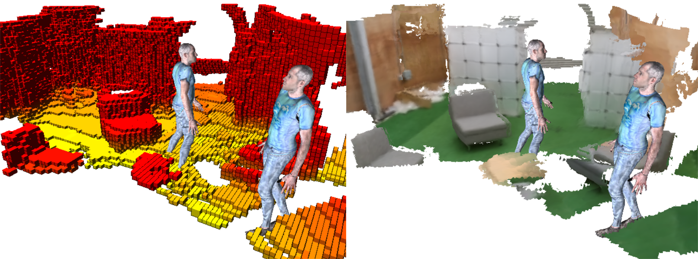

# smglib



This is the open-source Python framework and *Oxford Hybrid Mapping* dataset associated with our drone research in the [Cyber-Physical Systems](https://www.cs.ox.ac.uk/activities/cyberphysical/) group at the University of Oxford.

### Oxford Hybrid Mapping Dataset

The dataset can be downloaded from [here](https://hybridmapping-ohm.s3.eu-west-1.amazonaws.com/ohm.tar.gz). It contains a single directory called `ohm` that has a subdirectory for each sequence in the dataset. By default, our framework expects it to be extracted into `C:/datasets` or `D:/datasets`, but if you want to put it somewhere else, just modify `determine_dataset_root_dir.sh` in `smg-rescueflight/smg/rescueflight/datasets` as desired. (We'll introduce an environment variable for it ultimately.)

### Installation

Note #1: Installing the framework currently takes a bit more effort than we would prefer (sorry!). We plan to address this in future.

Note #2: The installation instructions are currently for Windows, although there's no inherent reason why the framework can't work on Linux or Mac OS X. Again, we plan to address this in future.

1. Install [Git for Windows](https://gitforwindows.org). (You'll need it to run some of the `.sh` scripts.)

2. Install [Anaconda](https://www.anaconda.com).

3. Install [Visual Studio](https://visualstudio.microsoft.com/downloads). (We've tried our framework with both VS2017 and VS2019. It should work with other versions as well, but a few tweaks may be required.)

4. Choose a root directory, hereafter (and in the submodule-level README files) referred to as `<root>`.

5. Clone the `smglib` repository into `<root>`, e.g.

   ```
   git clone --recursive git@github.com:sgolodetz/smglib.git <root>
   ```

6. Create a Conda environment for the framework, e.g. `conda create -n smglib python==3.7`.

7. Follow the installation instructions specified in the submodule-level README files. Since some of the submodules depend on other submodules, the order in which the submodules are installed matters. One suitable installation order is as follows.

   Group 1:
   - [smg-dvmvs](https://github.com/sgolodetz/smg-dvmvs/blob/master/README.md)
   - [smg-imagesources](https://github.com/sgolodetz/smg-imagesources/blob/master/README.md)
   - [smg-joysticks](https://github.com/sgolodetz/smg-joysticks/blob/master/README.md)
   - [smg-pyopencv](https://github.com/sgolodetz/smg-pyopencv/blob/master/README.md)
   - [smg-rigging](https://github.com/sgolodetz/smg-rigging/blob/master/README.md)
   - [smg-robotdepot](https://github.com/sgolodetz/smg-robotdepot/blob/master/README.md) [optional, only needed if using a DJI Robomaster S1]
   - [smg-utility](https://github.com/sgolodetz/smg-utility/blob/master/README.md)

   Group 2:
   - [smg-detectron2](https://github.com/sgolodetz/smg-detectron2/blob/master/README.md) -> smg-utility
   - [smg-mvdepthnet](https://github.com/sgolodetz/smg-mvdepthnet/blob/master/README.md) -> smg-rigging
   - [smg-open3d](https://github.com/sgolodetz/smg-open3d/blob/master/README.md) -> smg-utility
   - [smg-opengl](https://github.com/sgolodetz/smg-opengl/blob/master/README.md) -> smg-rigging, smg-utility
   - [smg-openni](https://github.com/sgolodetz/smg-openni/blob/master/README.md) -> smg-imagesources [optional, only needed if using OpenNI cameras]
   - [smg-pyorbslam2](https://github.com/sgolodetz/smg-pyorbslam2/blob/master/README.md) -> smg-pyopencv
   - [smg-relocalisation](https://github.com/sgolodetz/smg-relocalisation/blob/master/README.md) -> smg-rigging
   - [smg-rotory](https://github.com/sgolodetz/smg-rotory/blob/master/README.md) -> smg-imagesources, smg-rigging

   Group 3:
   - [smg-mediapipe](https://github.com/sgolodetz/smg-mediapipe/blob/master/README.md) -> smg-open3d [optional, only needed if using the chair detector]
   - [smg-meshing](https://github.com/sgolodetz/smg-meshing/blob/master/README.md) -> smg-open3d, smg-opengl
   - [smg-pyleap](https://github.com/sgolodetz/smg-pyleap/blob/master/README.md) -> smg-opengl
   - [smg-pyoctomap](https://github.com/sgolodetz/smg-pyoctomap/blob/master/README.md) -> smg-opengl, smg-rigging
   - [smg-skeletons](https://github.com/sgolodetz/smg-skeletons/blob/master/README.md) -> smg-opengl

   Group 4:
   - [smg-comms](https://github.com/sgolodetz/smg-comms/blob/master/README.md) -> smg-rigging, smg-skeletons, smg-utility
   - [smg-mapping](https://github.com/sgolodetz/smg-mapping/blob/master/README.md) -> smg-joysticks, smg-open3d, smg-pyoctomap, smg-skeletons
   - [smg-navigation](https://github.com/sgolodetz/smg-navigation/blob/master/README.md) -> smg-pyoctomap
   - [smx-smplx](https://github.com/sgolodetz/smg-smplx/blob/master/README.md) -> smg-skeletons
   - [smg-vicon](https://github.com/sgolodetz/smg-vicon/blob/master/README.md) -> smg-vicon [optional, only needed if using a Vicon system or data saved from one]

   Group 5:
   - [smg-lcrnet](https://github.com/sgolodetz/smg-lcrnet/blob/master/README.md) -> smg-comms
   - [smg-rotorcontrol](https://github.com/sgolodetz/smg-rotorcontrol/blob/master/README.md) -> smg-joysticks, smg-navigation, smg-rotory

   Group 6:
   - [smg-rotorsim](https://github.com/sgolodetz/smg-rotorsim/blob/master/README.md) -> smg-meshing, smg-rotorcontrol

   Group 7:
   - [smg-rescueflight](https://github.com/sgolodetz/smg-rescueflight/blob/master/README.md) -> everything!

### Usage

See [here](USAGE.md).

### Publications

If you build on this framework for your research, please cite the following paper:

```
@inproceedings{Golodetz2022TR,
author = {Stuart Golodetz and Madhu Vankadari* and Aluna Everitt* and Sangyun Shin* and Andrew Markham and Niki Trigoni},
title = {{Real-Time Hybrid Mapping of Populated Indoor Scenes using a Low-Cost Monocular UAV}},
booktitle = {IEEE/RSJ International Conference on Intelligent Robots and Systems (IROS)},
month = {October},
year = {2022}
}
```

### Acknowledgements

This work was supported by Amazon Web Services via the [Oxford-Singapore Human-Machine Collaboration Programme](https://www.mpls.ox.ac.uk/innovation-and-business-partnerships/human-machine-collaboration/human-machine-collaboration-programme-oxford-research-pillar), and by UKRI as part of the [ACE-OPS](https://gtr.ukri.org/projects?ref=EP%2FS030832%2F1) grant. We would also like to thank [Graham Taylor](https://www.biology.ox.ac.uk/people/professor-graham-taylor) for the use of the Wytham Flight Lab, [Philip Torr](https://eng.ox.ac.uk/people/philip-torr/) for the use of an Asus ZenFone AR, and [Tommaso Cavallari](https://uk.linkedin.com/in/tcavallari) for implementing TangoCapture.
